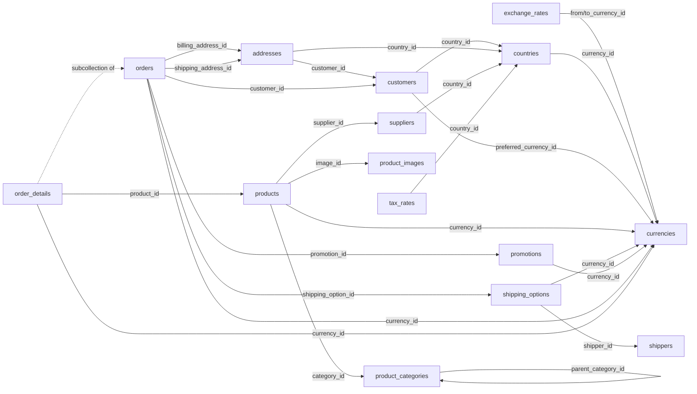

# 🛒 CRM Orders

> **Note**: This schema describes and relies on features of **inGitDB** that may not be fully implemented
> yet. Its primary purpose is to drive development of inGitDB by serving as a comprehensive real-world use
> case and to demonstrate its capabilities for business-critical applications.

CRM Orders is an open-source **inGitDB** schema template for a complete company CRM, ordering, and
shipping system. It models everything from ISO currency definitions and customer accounts through product
catalogues, supplier management, shipping carriers, and multi-line orders — including tax rates and
promotional discounts.

Because every record is a plain YAML/JSON file committed to Git, the full transaction history is an
immutable audit log with zero extra infrastructure. Any developer, auditor, or AI agent can inspect,
query, and amend data with a text editor or `git blame`.

This demo showcases inGitDB's support for **foreign-key relationships**, **subcollections**, **enum
constraints**, **regex patterns**, cross-collection **referential integrity**, and **human-readable
records**.

## 📋 Collections Overview

| Collection | Description |
|------------|-------------|
| [currencies](#currencies) | ISO 4217 currency definitions |
| [exchange_rates](#exchange_rates) | Point-in-time currency exchange rates |
| [countries](#countries) | ISO 3166-1 country codes and metadata |
| [customers](#customers) | Customer accounts — the CRM core |
| [addresses](#addresses) | Reusable billing and shipping addresses per customer |
| [product_categories](#product_categories) | Hierarchical product taxonomy |
| [product_images](#product_images) | Shareable product images |
| [products](#products) | Product catalogue with pricing and inventory |
| [suppliers](#suppliers) | Product suppliers and vendor contacts |
| [shippers](#shippers) | Shipping carrier definitions |
| [shipping_options](#shipping_options) | Service levels offered by each carrier |
| [tax_rates](#tax_rates) | Tax rates by country and optional region |
| [promotions](#promotions) | Discount codes and coupon campaigns |
| [orders](#orders) | Customer order records |
| [order_details](#order_details) | Line items — subcollection of orders |

## 🗺️ Data Model

---

## 💱 currencies

> ISO 4217 currency definitions — the monetary foundation for all pricing, rates, and orders.

| Column | Type | Required | Constraints | Foreign Key |
|--------|------|:--------:|-------------|-------------|
| id | string | ✅ | min_length:3, max_length:3, regex:`^[A-Z]{3}$` | |
| name | string | ✅ | min_length:2, max_length:64 | |
| symbol | string | ✅ | min_length:1, max_length:8 | |
| decimal_places | int | ✅ | min:0, max:4 | |
| is_active | bool | ✅ | | |

### Example Records

| id | name | symbol | decimal_places | is_active |
|----|------|--------|:--------------:|:---------:|
| USD | US Dollar | $ | 2 | true |
| EUR | Euro | € | 2 | true |
| GBP | Pound Sterling | £ | 2 | true |
| JPY | Japanese Yen | ¥ | 0 | true |
| AUD | Australian Dollar | A$ | 2 | true |

### Referrers of currencies

- [exchange_rates](#exchange_rates): from_currency_id, to_currency_id
- [countries](#countries): currency_id
- [customers](#customers): preferred_currency_id
- [products](#products): currency_id
- [shipping_options](#shipping_options): currency_id
- [promotions](#promotions): currency_id
- [orders](#orders): currency_id
- [order_details](#order_details): currency_id

---

## 📈 exchange_rates

> Point-in-time exchange rates between currency pairs, used for multi-currency order reporting.

| Column | Type | Required | Constraints | Foreign Key |
|--------|------|:--------:|-------------|-------------|
| id | string | ✅ | max_length:64 | |
| from_currency_id | string | ✅ | | [currencies](#currencies) |
| to_currency_id | string | ✅ | | [currencies](#currencies) |
| rate | float | ✅ | min:0 | |
| effective_date | date | ✅ | | |
| source | string | ❌ | max_length:128 | |

### Example Records

| id | from_currency_id | to_currency_id | rate | effective_date | source |
|----|:----------------:|:--------------:|-----:|----------------|--------|
| usd-eur-2024-01-01 | USD | EUR | 0.9182 | 2024-01-01 | ECB |
| usd-gbp-2024-01-01 | USD | GBP | 0.7895 | 2024-01-01 | ECB |
| eur-usd-2024-01-01 | EUR | USD | 1.0890 | 2024-01-01 | ECB |
| usd-jpy-2024-01-01 | USD | JPY | 141.45 | 2024-01-01 | ECB |

---

## 🌍 countries

> ISO 3166-1 alpha-2 country codes with default currency and dialling prefix.

| Column | Type | Required | Constraints | Foreign Key |
|--------|------|:--------:|-------------|-------------|
| id | string | ✅ | min_length:2, max_length:2, regex:`^[A-Z]{2}$` | |
| name | string | ✅ | min_length:2, max_length:100 | |
| currency_id | string | ✅ | | [currencies](#currencies) |
| phone_prefix | string | ✅ | regex:`^\+\d{1,4}$` | |
| region | string | ❌ | enum: Africa, Americas, Asia, Europe, Oceania | |

### Example Records

| id | name | currency_id | phone_prefix | region |
|----|------|:-----------:|:------------:|--------|
| US | United States | USD | +1 | Americas |
| GB | United Kingdom | GBP | +44 | Europe |
| DE | Germany | EUR | +49 | Europe |
| JP | Japan | JPY | +81 | Asia |
| AU | Australia | AUD | +61 | Oceania |

### Referrers of countries

- [customers](#customers): country_id
- [addresses](#addresses): country_id
- [suppliers](#suppliers): country_id
- [tax_rates](#tax_rates): country_id

---

## 👤 customers

> Customer accounts — the CRM core record linking contacts, preferences, and order history.

| Column | Type | Required | Constraints | Foreign Key |
|--------|------|:--------:|-------------|-------------|
| id | string | ✅ | max_length:64 | |
| first_name | string | ✅ | min_length:1, max_length:64 | |
| last_name | string | ✅ | min_length:1, max_length:64 | |
| email | string | ✅ | max_length:254, regex:`^[^@\s]+@[^@\s]+\.[^@\s]+$` | |
| phone | string | ❌ | regex:`^\+\d{7,15}$` | |
| country_id | string | ✅ | | [countries](#countries) |
| preferred_currency_id | string | ❌ | | [currencies](#currencies) |
| created_at | datetime | ✅ | | |
| is_active | bool | ✅ | | |
| notes | string | ❌ | max_length:1000 | |

### Example Records

| id | first_name | last_name | email | phone | country_id | preferred_currency_id | is_active |
|----|-----------|-----------|-------|-------|:----------:|:--------------------:|:---------:|
| cust-001 | Alice | Johnson | alice.johnson@example.com | +14155550101 | US | USD | true |
| cust-002 | Bruno | Müller | bruno.mueller@example.de | +4930555012 | DE | EUR | true |
| cust-003 | Yuki | Tanaka | yuki.tanaka@example.jp | +81312345678 | JP | JPY | true |
| cust-004 | Sarah | Williams | sarah.w@example.co.uk | +447911123456 | GB | GBP | true |

### Referrers of customers

- [addresses](#addresses): customer_id
- [orders](#orders): customer_id

---

## 📍 addresses

> Reusable billing and shipping addresses, each linked to a customer and a country.

| Column | Type | Required | Constraints | Foreign Key |
|--------|------|:--------:|-------------|-------------|
| id | string | ✅ | max_length:64 | |
| customer_id | string | ✅ | | [customers](#customers) |
| label | string | ❌ | max_length:64 | |
| line1 | string | ✅ | min_length:1, max_length:128 | |
| line2 | string | ❌ | max_length:128 | |
| city | string | ✅ | min_length:1, max_length:100 | |
| state | string | ❌ | max_length:100 | |
| postal_code | string | ✅ | min_length:1, max_length:20 | |
| country_id | string | ✅ | | [countries](#countries) |
| is_default | bool | ✅ | | |

### Example Records

| id | customer_id | label | line1 | city | state | postal_code | country_id | is_default |
|----|-------------|-------|-------|------|-------|:-----------:|:----------:|:----------:|
| addr-001 | cust-001 | Home | 42 Maple Ave | San Francisco | CA | 94102 | US | true |
| addr-002 | cust-001 | Work | 100 Market St Ste 900 | San Francisco | CA | 94105 | US | false |
| addr-003 | cust-002 | Home | Hauptstraße 12 | Berlin | | 10115 | DE | true |
| addr-004 | cust-004 | Home | 15 Baker Street | London | England | W1U 6SB | GB | true |

### Referrers of addresses

- [orders](#orders): billing_address_id, shipping_address_id

---

## 🗂️ product_categories

> Hierarchical product taxonomy — categories can nest under a parent category.

| Column | Type | Required | Constraints | Foreign Key |
|--------|------|:--------:|-------------|-------------|
| id | string | ✅ | max_length:64 | |
| name | string | ✅ | min_length:2, max_length:100 | |
| parent_category_id | string | ❌ | | [product_categories](#product_categories) |
| description | string | ❌ | max_length:500 | |
| sort_order | int | ❌ | min:0 | |
| is_active | bool | ✅ | | |

### Example Records

| id | name | parent_category_id | sort_order | is_active |
|----|------|--------------------|:----------:|:---------:|
| electronics | Electronics | | 1 | true |
| smartphones | Smartphones | electronics | 1 | true |
| laptops | Laptops | electronics | 2 | true |
| accessories | Accessories | | 2 | true |
| cases | Cases & Covers | accessories | 1 | true |

### Referrers of product_categories

- [product_categories](#product_categories): parent_category_id (self-referential)
- [products](#products): category_id

---

## 🖼️ product_images

> Shareable product images — a single image record can be referenced by multiple products.

| Column | Type | Required | Constraints | Foreign Key |
|--------|------|:--------:|-------------|-------------|
| id | string | ✅ | max_length:64 | |
| url | string | ✅ | max_length:512, regex:`^https?://` | |
| alt_text | string | ✅ | max_length:255 | |
| width_px | int | ❌ | min:1 | |
| height_px | int | ❌ | min:1 | |
| sort_order | int | ❌ | min:0 | |

### Example Records

| id | url | alt_text | width_px | height_px |
|----|-----|----------|:--------:|:---------:|
| img-001 | https://cdn.example.com/products/phone-x1-front.jpg | Phone X1 front view | 1200 | 1200 |
| img-002 | https://cdn.example.com/products/phone-x1-back.jpg | Phone X1 rear view | 1200 | 1200 |
| img-003 | https://cdn.example.com/products/laptop-pro-15.jpg | Laptop Pro 15 side view | 1600 | 900 |

### Referrers of product_images

- [products](#products): image_id

---

## 📦 products

> Product catalogue — each entry has a unique SKU, price, supplier, category, and live stock count.

| Column | Type | Required | Constraints | Foreign Key |
|--------|------|:--------:|-------------|-------------|
| id | string | ✅ | max_length:64 | |
| sku | string | ✅ | min_length:3, max_length:64, regex:`^[A-Z0-9\-]+$` | |
| name | string | ✅ | min_length:2, max_length:200 | |
| description | string | ❌ | max_length:2000 | |
| category_id | string | ✅ | | [product_categories](#product_categories) |
| supplier_id | string | ✅ | | [suppliers](#suppliers) |
| image_id | string | ❌ | | [product_images](#product_images) |
| unit_price | float | ✅ | min:0.01 | |
| currency_id | string | ✅ | | [currencies](#currencies) |
| weight_kg | float | ❌ | min:0 | |
| stock_quantity | int | ✅ | min:0 | |
| is_active | bool | ✅ | | |

### Example Records

| id | sku | name | category_id | supplier_id | image_id | unit_price | currency_id | stock_quantity |
|----|-----|------|-------------|-------------|----------|:----------:|:-----------:|:--------------:|
| prod-001 | PHONE-X1-128 | Phone X1 128 GB | smartphones | sup-001 | img-001 | 799.99 | USD | 250 |
| prod-002 | LAPTOP-PRO-15 | Laptop Pro 15" | laptops | sup-002 | img-003 | 1299.00 | USD | 80 |
| prod-003 | CASE-X1-BLK | Phone X1 Black Case | cases | sup-003 | | 19.99 | USD | 500 |

### Referrers of products

- [order_details](#order_details): product_id

---

## 🏭 suppliers

> Vendor and supplier contacts for the products in the catalogue.

| Column | Type | Required | Constraints | Foreign Key |
|--------|------|:--------:|-------------|-------------|
| id | string | ✅ | max_length:64 | |
| name | string | ✅ | min_length:2, max_length:200 | |
| contact_name | string | ❌ | max_length:100 | |
| email | string | ✅ | max_length:254, regex:`^[^@\s]+@[^@\s]+\.[^@\s]+$` | |
| phone | string | ❌ | regex:`^\+\d{7,15}$` | |
| country_id | string | ✅ | | [countries](#countries) |
| website | string | ❌ | max_length:512, regex:`^https?://` | |
| is_active | bool | ✅ | | |

### Example Records

| id | name | contact_name | email | country_id | website | is_active |
|----|------|-------------|-------|:----------:|---------|:---------:|
| sup-001 | TechSource Ltd | Jenny Park | supply@techsource.example | US | https://techsource.example | true |
| sup-002 | Computex GmbH | Klaus Werner | orders@computex.example | DE | https://computex.example | true |
| sup-003 | Accessory World | Li Wei | ops@accessoryworld.example | US | https://accessoryworld.example | true |

### Referrers of suppliers

- [products](#products): supplier_id

---

## 🚚 shippers

> Shipping carrier definitions — each shipper may offer multiple service levels.

| Column | Type | Required | Constraints | Foreign Key |
|--------|------|:--------:|-------------|-------------|
| id | string | ✅ | max_length:64 | |
| name | string | ✅ | min_length:2, max_length:100 | |
| tracking_url_template | string | ❌ | max_length:512 | |
| contact_email | string | ❌ | max_length:254, regex:`^[^@\s]+@[^@\s]+\.[^@\s]+$` | |
| is_active | bool | ✅ | | |

> `tracking_url_template` supports the `{tracking_number}` placeholder — e.g.
> `https://carrier.example/track?n={tracking_number}`.

### Example Records

| id | name | tracking_url_template | contact_email | is_active |
|----|------|-----------------------|---------------|:---------:|
| fedex | FedEx | `https://www.fedex.com/apps/fedextrack/?tracknumbers={tracking_number}` | support@fedex.example | true |
| ups | UPS | `https://www.ups.com/track?tracknum={tracking_number}` | support@ups.example | true |
| dhl | DHL | `https://www.dhl.com/en/express/tracking.html?AWB={tracking_number}` | support@dhl.example | true |

### Referrers of shippers

- [shipping_options](#shipping_options): shipper_id

---

## 🚀 shipping_options

> Service levels offered by each carrier — defines price, speed tier, and estimated transit days.

| Column | Type | Required | Constraints | Foreign Key |
|--------|------|:--------:|-------------|-------------|
| id | string | ✅ | max_length:64 | |
| shipper_id | string | ✅ | | [shippers](#shippers) |
| name | string | ✅ | min_length:2, max_length:100 | |
| service_level | string | ✅ | enum: economy, standard, express, overnight | |
| base_price | float | ✅ | min:0 | |
| currency_id | string | ✅ | | [currencies](#currencies) |
| estimated_days_min | int | ✅ | min:0 | |
| estimated_days_max | int | ✅ | min:0 | |
| is_active | bool | ✅ | | |

### Example Records

| id | shipper_id | name | service_level | base_price | currency_id | est. days min | est. days max |
|----|:----------:|------|:-------------:|:----------:|:-----------:|:-------------:|:-------------:|
| fedex-standard | fedex | FedEx Standard | standard | 5.99 | USD | 3 | 5 |
| fedex-express | fedex | FedEx Express | express | 14.99 | USD | 1 | 2 |
| ups-overnight | ups | UPS Overnight | overnight | 29.99 | USD | 1 | 1 |
| dhl-economy | dhl | DHL Economy | economy | 3.99 | USD | 5 | 10 |

### Referrers of shipping_options

- [orders](#orders): shipping_option_id

---

## 🧾 tax_rates

> Tax rates per country and optional sub-region — applied when computing order tax amounts.

| Column | Type | Required | Constraints | Foreign Key |
|--------|------|:--------:|-------------|-------------|
| id | string | ✅ | max_length:64 | |
| country_id | string | ✅ | | [countries](#countries) |
| region | string | ❌ | max_length:100 | |
| label | string | ✅ | max_length:50 | |
| rate_percent | float | ✅ | min:0, max:100 | |
| effective_date | date | ✅ | | |
| is_active | bool | ✅ | | |

### Example Records

| id | country_id | region | label | rate_percent | effective_date | is_active |
|----|:----------:|--------|-------|:------------:|----------------|:---------:|
| us-ca-sales | US | CA | Sales Tax | 8.25 | 2020-01-01 | true |
| us-ny-sales | US | NY | Sales Tax | 8.875 | 2021-03-01 | true |
| de-vat | DE | | VAT | 19.00 | 2021-01-01 | true |
| gb-vat | GB | | VAT | 20.00 | 2011-01-04 | true |
| au-gst | AU | | GST | 10.00 | 2000-07-01 | true |

---

## 🏷️ promotions

> Discount codes and coupon campaigns — applied to orders for percentage or fixed-amount discounts.

| Column | Type | Required | Constraints | Foreign Key |
|--------|------|:--------:|-------------|-------------|
| id | string | ✅ | max_length:64 | |
| code | string | ✅ | min_length:3, max_length:32, regex:`^[A-Z0-9_\-]+$` | |
| description | string | ❌ | max_length:500 | |
| discount_type | string | ✅ | enum: percent, fixed | |
| discount_value | float | ✅ | min:0 | |
| currency_id | string | ❌ | required when discount_type=`fixed` | [currencies](#currencies) |
| min_order_amount | float | ❌ | min:0 | |
| valid_from | date | ✅ | | |
| valid_until | date | ❌ | | |
| max_uses | int | ❌ | min:1 | |
| uses_count | int | ✅ | min:0 | |
| is_active | bool | ✅ | | |

### Example Records

| id | code | discount_type | discount_value | currency_id | min_order_amount | valid_from | valid_until | max_uses | uses_count |
|----|------|:-------------:|:--------------:|:-----------:|:----------------:|:----------:|:-----------:|:--------:|:----------:|
| promo-summer24 | SUMMER24 | percent | 10.0 | | 50.00 | 2024-06-01 | 2024-08-31 | 1000 | 342 |
| promo-welcome | WELCOME15 | percent | 15.0 | | | 2023-01-01 | | | 1987 |
| promo-flat20 | FLAT20 | fixed | 20.00 | USD | 100.00 | 2024-01-01 | 2024-12-31 | 500 | 89 |

### Referrers of promotions

- [orders](#orders): promotion_id

---

## 🛒 orders

> Customer order records — captures the full purchase snapshot at the time of placement.

| Column | Type | Required | Constraints | Foreign Key |
|--------|------|:--------:|-------------|-------------|
| id | string | ✅ | max_length:64 | |
| customer_id | string | ✅ | | [customers](#customers) |
| billing_address_id | string | ✅ | | [addresses](#addresses) |
| shipping_address_id | string | ✅ | | [addresses](#addresses) |
| shipping_option_id | string | ✅ | | [shipping_options](#shipping_options) |
| currency_id | string | ✅ | | [currencies](#currencies) |
| promotion_id | string | ❌ | | [promotions](#promotions) |
| status | string | ✅ | enum: pending, confirmed, processing, shipped, delivered, cancelled, refunded | |
| subtotal | float | ✅ | min:0 | |
| discount_amount | float | ✅ | min:0 | |
| tax_amount | float | ✅ | min:0 | |
| shipping_amount | float | ✅ | min:0 | |
| total_amount | float | ✅ | min:0 | |
| placed_at | datetime | ✅ | | |
| shipped_at | datetime | ❌ | | |
| delivered_at | datetime | ❌ | | |
| notes | string | ❌ | max_length:1000 | |

> [order_details](#order_details) is a **subcollection** of this collection — line items are stored as
> child records nested under each order record.

### Example Records

| id | customer_id | shipping_option_id | currency_id | status | subtotal | discount | tax | shipping | total | placed_at |
|----|------------|:------------------:|:-----------:|:------:|:--------:|:--------:|:---:|:--------:|:-----:|-----------|
| ord-2024-0001 | cust-001 | fedex-standard | USD | delivered | 819.98 | 0.00 | 67.64 | 5.99 | 893.61 | 2024-02-14T10:32:00Z |
| ord-2024-0002 | cust-002 | dhl-economy | EUR | shipped | 1299.00 | 129.90 | 93.53 | 3.99 | 1266.62 | 2024-03-01T16:45:00Z |
| ord-2024-0003 | cust-001 | fedex-express | USD | processing | 19.99 | 0.00 | 1.65 | 14.99 | 36.63 | 2024-03-18T09:10:00Z |

---

## 📋 order_details

> Line items for an order — each record is one product at a given quantity and unit price.

**Subcollection of [orders](#orders)** — records live under their parent order record in the repository
(e.g. `orders/$records/ord-2024-0001/order_details/$records/line-001.yaml`).

| Column | Type | Required | Constraints | Foreign Key |
|--------|------|:--------:|-------------|-------------|
| id | string | ✅ | max_length:64 | |
| product_id | string | ✅ | | [products](#products) |
| quantity | int | ✅ | min:1 | |
| unit_price | float | ✅ | min:0 | |
| currency_id | string | ✅ | | [currencies](#currencies) |
| discount_percent | float | ❌ | min:0, max:100 | |
| line_total | float | ✅ | min:0 | |

### Example Records

> The records below belong to order `ord-2024-0001`.

| id | product_id | quantity | unit_price | currency_id | discount_percent | line_total |
|----|:----------:|:--------:|:----------:|:-----------:|:----------------:|:----------:|
| line-001 | prod-001 | 1 | 799.99 | USD | | 799.99 |
| line-002 | prod-003 | 1 | 19.99 | USD | | 19.99 |
